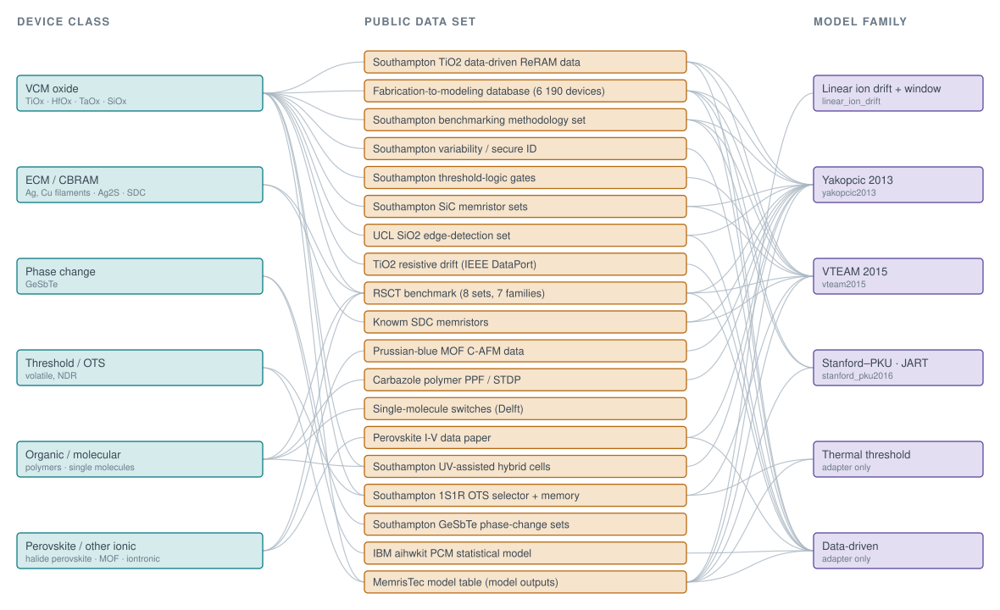

# memristec-skill


**An AI-agent skill, a verified Python toolkit and an executed six-chapter book on compact
memristor models, built by studying the [MemrisTec Memristor Model Platform](https://memristec.de/memristor-model-platform/)
(DFG priority programme SPP 2262) end to end — every model written from its paper, every
figure generated live, every claim checked.**

<p align="center">
  <a href="references/taxonomy.md"></a>
</p>
<p align="center"><sub>Which device class a public data set belongs to, and which model family fits it. Every node is explained, with the links to the data, in <a href="references/taxonomy.md"><code>references/taxonomy.md</code></a>.</sub></p>

This repository packages practical, executed knowledge about compact memristor models in a
form both humans and AI coding agents can use: a skill definition ([`SKILL.md`](SKILL.md))
with nine workflows, clean-room models on one ODE driver (`scripts/`), an adapter that runs
*your own* clone of the MemrisTec Model Library and compares numbers, distilled references
(`references/`), and a book of six chapter notebooks in which **every physics claim is
executed and checked** — from Chua's definition and the pinched loop to threshold and
filamentary switching, pulse programming for neuromorphic frameworks, and a fit whose
identifiability is measured rather than assumed.

> The MemrisTec Model Library is developed by the SPP 2262 consortium (TU Dresden, RWTH
> Aachen and partners) and has no licence file. **This is an unofficial, independent
> project**: no line of the library is in this repository; the models are transcribed from
> the cited papers and cross-checked against the library in numbers through the adapter.

> **Feedback is highly appreciated.** Open an issue for anything wrong, unclear or missing —
> especially: a physics check you believe asserts the wrong thing, a parameter table that
> disagrees with its paper, a device class or a public data set missing from the map, or a
> platform where the notebooks do not run.

## Why this exists

Compact memristor models are the interface between device physics and every neuromorphic
simulation, yet the models one finds in libraries disagree with their own names and papers:
the MemrisTec folder called *Biolek* implements Joglekar's window, one runner ignores its
voltage argument, another calls an undefined class, two folders cite the wrong paper. An AI
agent asked to "simulate a memristor with the MemrisTec models" had nothing verified to stand
on. This repository is the verified ground: models from the papers, one driver, a book that
checks 84 claims when it runs, and a ledger of what was found upstream — kept in the study
repository and reported to the maintainers by the author, never by an agent.

## Quick start

```bash
scripts/install_memristec_windows.ps1        # or bash scripts/install_memristec.sh; both accept a dry run
python scripts/verify_memristec.py           # exit 0 = environment and physics OK
python scripts/memristec_tools.py --selftest
python -m pytest tests -q                    # ~20 s; the cross-checks skip without a clone
```

With a local clone of the library, `export MEMRISTEC_MODEL_LIBRARY=/path/to/memristec-model-library`
adds the cross-checks (health check 5/5, `python scripts/upstream_adapter.py`).
Manual: [`docs/USER_MANUAL.md`](docs/USER_MANUAL.md). For AI agents: [`SKILL.md`](SKILL.md),
[`AGENTS.md`](AGENTS.md). Design notes: [`docs/DESIGN.md`](docs/DESIGN.md). Contributing:
[`CONTRIBUTING.md`](CONTRIBUTING.md).

## Features

- **Four clean-room models on one driver** (`scripts/memristec_tools.py`): linear ion drift
  with the none / Joglekar / Biolek / Prodromakis windows (Strukov 2008 and the window
  papers), Yakopcic 2011/2013, VTEAM (Kvatinsky 2015) and the Stanford–PKU filamentary model
  with self-heating (Jiang 2016). One state variable in [0, 1], fixed-step RK4/Euler or
  `solve_ivp`, I-V sweeps, lobe-wise loop metrics, dynamic route maps, pulse trains and
  `pulse_response`. Unknown parameter names raise; equations and parameter provenance are in
  [`references/models.md`](references/models.md).
- **Measured independence.** `scripts/upstream_adapter.py` imports a model folder from your
  clone, wraps it behind the same interface and compares derivative fields on a grid: the
  four shimmed folders agree with the clean-room models to 2e-16 … 4e-15, with tolerances in
  a schema-versioned record. The same comparison found the upstream defects listed below.
- **An executed book, one notebook per chapter** (`chapters/`, index in
  [`chapters/README.md`](chapters/README.md)): the memristor as a state-controlled resistor;
  linear ion drift and windows; threshold switching with VTEAM; filamentary switching with
  Stanford–PKU and Yakopcic; pulses, retention and neuromorphic hand-off; benchmarking,
  numerics, fitting and the library cross-check. **85 cells, 84 inline checks, 25 captioned
  figures, 0 failures**, under two minutes to run, every notebook under 0.3 MB.
- **Reproducible by construction.** The notebooks are generated from `build/*.py`; a test
  fails if a committed notebook drifts from its source, carries a failed check or an
  uncaptioned figure, or leaks a personal path.
- **Guarded documentation.** Every CLI flag and every `--model` / `--window` choice is
  checked against `AGENTS.md` and the manual; `VERSION`, `CITATION.cff`, `CHANGELOG.md` and
  `SKILL.md` must agree; every source file carries its SPDX header.
- **A device / data / model map** ([`references/taxonomy.md`](references/taxonomy.md)):
  seven device classes in the library's own vocabulary, six model families by state
  variable, and nineteen public measurement data sets with their licences and links.
- **Weekly upstream watch** (`scripts/watch_upstream.py`, `scripts/register_watch_task.ps1`):
  fetches your clone of the library, lists new commits per branch and changed model folders
  since the previous run, and writes a dated log.

## Using it as an AI-agent skill

For [Claude Code](https://claude.com/claude-code) or any agent framework that understands
skill directories:

```bash
git clone <this repository> ~/.claude/skills/memristec      # user-level install
```

or per project into `<project>/.claude/skills/memristec`. The agent consults the skill
whenever a task involves memristors, RRAM compact models, window functions, pinched
hysteresis, pulse programming or the MemrisTec library. Other frameworks can ingest
`SKILL.md` as a system instruction and expose `scripts/` on the path.

## Using it as a plain Python toolkit

No AI required — ordinary Python (3.12+):

```python
import sys; sys.path.insert(0, "scripts")
from memristec_tools import make_model, iv_sweep, loop_metrics, pulse_response
m = make_model("stanford_pku2016")
res = iv_sweep(m, amplitude=1.5, frequency=1e3, cycles=1, n_per_cycle=20000)   # stiff: 20 000 points
print(loop_metrics(res)["r_max"] / loop_metrics(res)["r_min"])                    # HRS/LRS ≈ 180
ltp = pulse_response(make_model("vteam2015", x0=0.8), -0.5, width=0.02, period=0.05, n_pulses=20)
```

`python scripts/memristec_tools.py --model vteam2015 --amplitude 0.6 --cycles 2 --outdir out`
writes a CSV and a JSON audit record. Full flag tables: [`AGENTS.md`](AGENTS.md).

## What the book covers

| Chapter | Sections | Highlights |
|---|---|---|
| 1 The memristor as a state-controlled resistor | §1–4 | Chua's definition, the pinched loop and its frequency dependence, Strukov's affine memristance law checked to 0.1 %, the dynamic route map |
| 2 Linear ion drift and window functions | §5–8 | the terminal-state problem, Joglekar / Biolek / Prodromakis windows, stuck at the wall |
| 3 Threshold switching: VTEAM | §9–12 | dead band, switching loop, exponents and asymmetry, 1 000 reads that write nothing |
| 4 Filamentary switching | §13–16 | Stanford–PKU SET/RESET, sweep-rate dependence, self-heating measured (it follows the switch with the teaching parameters), Yakopcic's DRM, three families on one drive |
| 5 Pulses, retention and neuromorphic use | §17–20 | potentiation / depression curves, update nonlinearity, retention, a 4×4 crossbar programmed by pulse count |
| 6 Benchmarking, numerics, fitting and the library | §21–26 | four models on one stimulus, Euler vs RK4 convergence, a synthetic fit and its identifiability, the live cross-check against the library, the folders that are not compact models, how to contribute |

The checks caught the plan's own wrong assumptions while writing (self-heating does not move
V_set with the teaching parameters; identical pulses moved the state by different amounts
until a stimulus bug was fixed; a saturating drive carries no information about a rate
parameter) and surfaced the upstream findings kept as drafts next to this repository.

## Honest comparison with neighbours

| If you want… | Use | Why not this |
|---|---|---|
| The library itself, its website table and simulator | [MemrisTec Model Platform](https://memristec.de/memristor-model-platform/) | The canonical source; unlicensed as of 2026-09, so it cannot be redistributed or imported by a framework. This project studies it and cross-checks against it. |
| Device non-idealities inside a deep-learning framework | [aihwkit](https://github.com/IBM/aihwkit) (IBM), [MemTorch](https://github.com/coreylammie/MemTorch) | Production frameworks with fitted statistical device models; this project produces the pulse tables they consume (chapter 5 §20) and does not replace them. |
| Every published SPICE model in one place | [memristor-models-4-all](https://github.com/knowm/memristor-models-4-all) (Knowm) | A collection of SPICE decks, not executed or cross-checked; this project has four models, each verified. |
| Circuit-level memristor simulation in Verilog-A | [JART](https://www.emrl.de/JART.html) (RWTH/Jülich) | The physics VCM model with variability; here only as a planned clean-room target and a library folder run through the adapter. |
| Real device data | the map above and [`references/taxonomy.md`](references/taxonomy.md) | This project links to public data sets, it hosts none. |

## Roadmap

- **Validated:** full execution on Windows 10 / Python 3.12.14 / numpy 2.5 (2026-09-04),
  cross-checks against clone `f13423f` of the library (four folders), suite 191 passed with
  the clone; CI on Linux / Windows / macOS × Python 3.12 / 3.13 runs on every push (first run
  pending the first public push).
- **Parameter tables:** the Yakopcic, VTEAM and Stanford–PKU defaults are marked "as
  recalled" or "ours" in `references/models.md` until they are checked line by line against
  the papers — planned next.
- **Planned:** the JART VCM model as a clean-room target and a fitting workflow for pulse
  LTP/LTD data (the author's TaO$_x$ devices); the thermal threshold switches (Pickett–Williams,
  Kumar–Williams) once their papers are transcribed; an undergraduate course built from the
  book's figures; a PyPI package (name decision recorded, not yet taken).

## How it was built

Written with Claude Code (Claude Fable 5.1) between 2026-09-01 and 2026-09-04 in a study
repository that also holds the upstream audit, the findings ledger and the drafts: a
foundation release (environment, licence and guards, the first two models, the adapter), a
models-and-chapters plan executed task by task with a whole-project review in between, and a
data survey for the map. Effort ≈ 5 working sessions.

| Role (CRediT) | Fabio Campolim | Claude |
|---|---|---|
| Conceptualization, scope, physics targets, the clean-room rule | ● | ○ |
| Methodology (check-everything contract, skill / toolkit / book shape) | ● | ● |
| Software (models, driver, adapter, build tooling, tests) | ○ | ● |
| Validation (every check, cross-checks against the library, re-executions) | ○ | ● |
| Investigation (upstream defects, data survey, paper retrieval) | ○ | ● |
| Writing – original draft | ○ | ● |
| Writing – review & editing, decisions on scope, naming and publication | ● | ○ |

## Licence

Apache License 2.0 — see `LICENSE` and `NOTICE`. The MemrisTec Model Library
itself is studied, not redistributed; every model here is written from its
published paper (`references/models.md`).

### Disclaimer

This software is provided "as is", without warranty of any kind, express or
implied, including but not limited to the warranties of merchantability,
fitness for a particular purpose and non-infringement. In no event shall the
authors be liable for any claim, damages or other liability arising from,
out of or in connection with the software or its use. This project is
independent and not affiliated with or endorsed by MemrisTec, the DFG,
TU Dresden or RWTH Aachen University.
